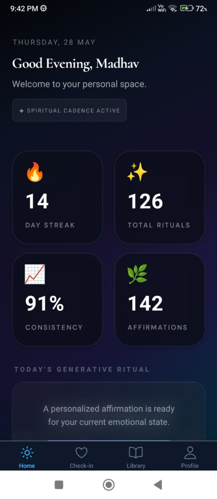
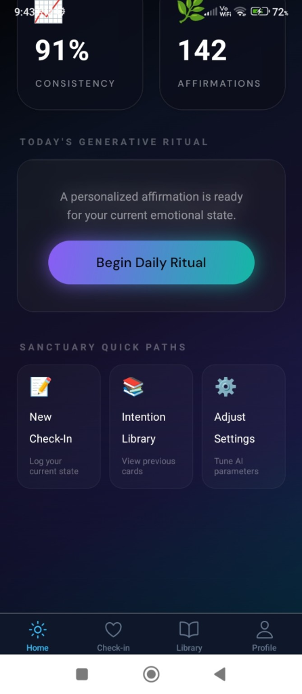
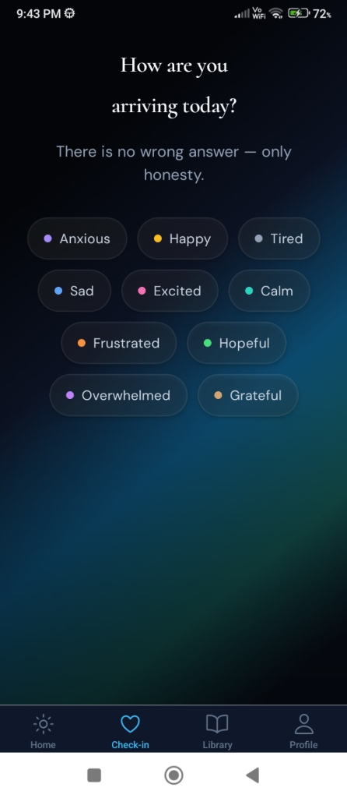
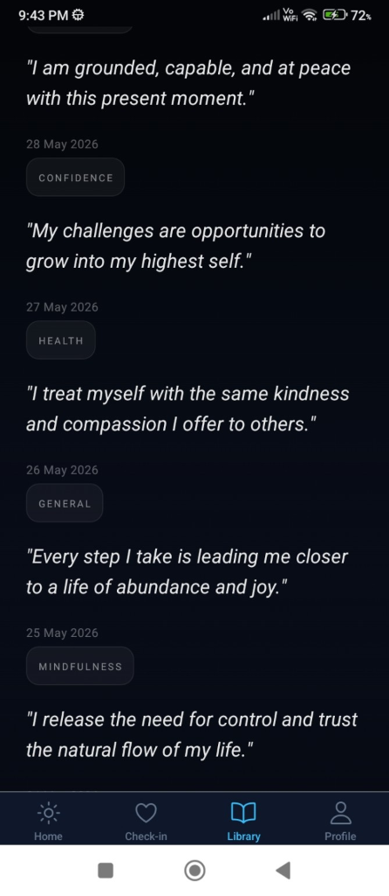
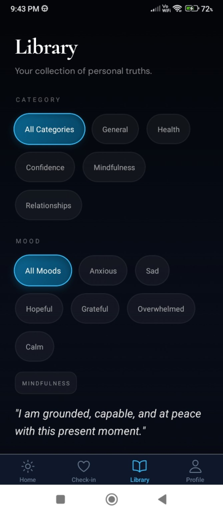
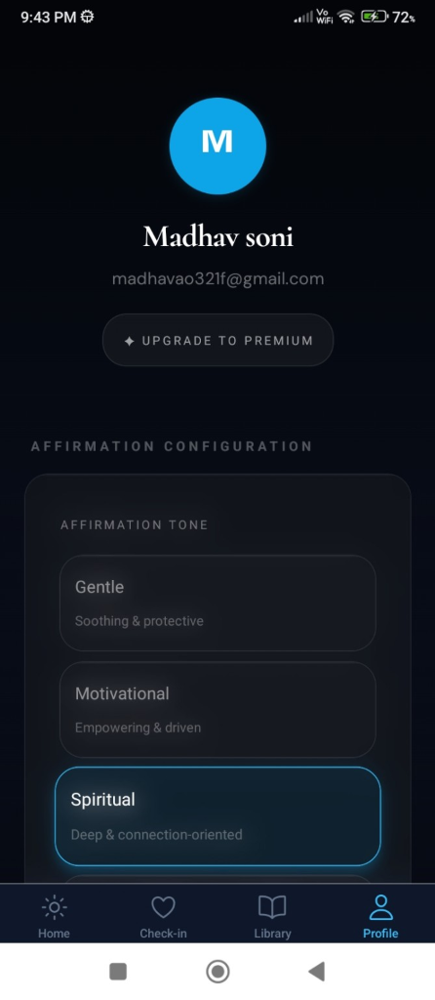
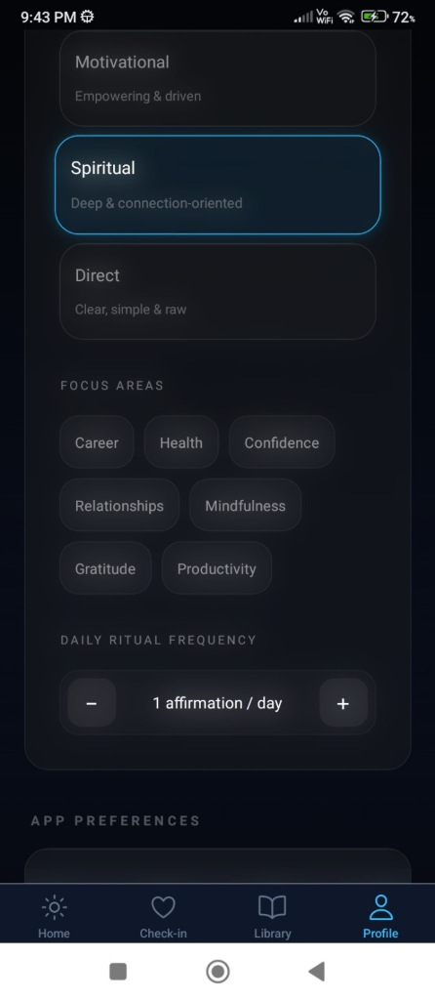
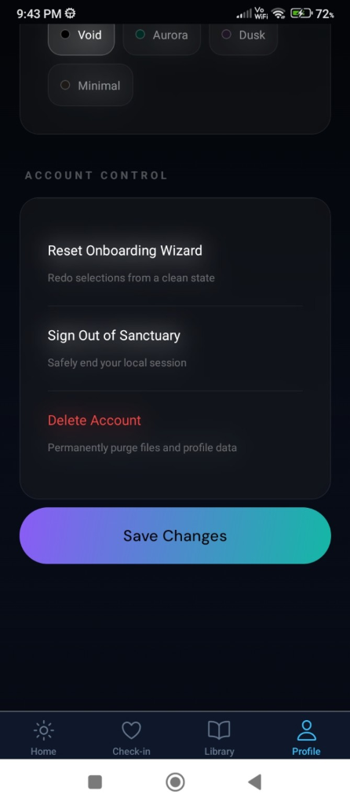

# 🌿 I AM WELL — Premium Generative AI Wellness & Ritual Sanctuary

[](#)
[](https://github.com/Madhav-Soni/iamwell/releases)
[](https://expo.dev/)
[](https://reactnative.dev/)
[](https://nodejs.org/)
[](https://www.mongodb.com/)
[](https://openai.com/)

> **"Your breath is proof that life still believes in your becoming."**  
> A premium, emotionally-precise generative AI wellness companion designed to help you cultivate quiet strength, daily mindfulness, and consistent self-reflection.

---

## 📖 The Vision & Story

In a world filled with noisy notifications, toxic productivity, and generic, robotic "wellness" quotes, **I AM WELL** was born to create a true digital sanctuary. 

Instead of presenting you with static, pre-written greeting-card copy, **I AM WELL** maps your personal emotional landscape. It leverages GPT-4o-Mini to synthesize your current mood, voice cadence preferences, reflection notes, and historical distress safety metrics into state-of-the-art, hyper-personalized **daily grounding rituals**. It is visual poetry combined with advanced, lightweight client-side interactions.

---

## ✨ Features that Define the Sanctuary

### 1. Multi-Screen Personalized Onboarding
A guided, ambient onboarding sequence designed to calibrate the app to your focus areas, vocal cadence preferences, and notification frequency. 

### 2. Mood & Reflection Check-in System
A beautiful, tactile interface where you select your emotional state (from Calm and Hopeful to Anxious or Overwhelmed) and write brief journal notes. Includes high-fidelity haptic feedback and dynamic micro-animations.

### 3. Cinematic Generative AI Ritual Screen
The hero screen of the app. It makes one clean backend call, goes through an elegant, glassmorphic loading transition, and reveals your custom daily affirmation with a smooth typewriter animation. Features:
- **Save to Sanctuary Library:** Add the intention card to your personal collection with a single tap.
- **Dynamic Share Card:** Export beautiful intention cards to share with friends or save as wallpapers.
- **Regenerate Intention:** Instantly spin up a new calibration if you need a different focus.

### 4. Interactive Intention Library
Your history of saved truths. Filtered instantly by category or mood with a responsive, wrapped grid of tags—eliminating awkward horizontal scrolling and optimizing space on mobile.

### 5. Deep Customization & Profile Settings
Adjust your reminder cadence, edit active focus topics, toggle theme aesthetics, and view your daily practice analytics.

---

## 📱 Interface Gallery

| 1. User Stats & Dashboard | 2. AI Ritual Trigger Card | 3. Mood Check-in Landing |
|---|---|---|
|  |  |  |

| 4. Intention Library List | 5. Category & Mood Filters | 6. Profile Configuration |
|---|---|---|
|  |  |  |

| 7. Focus & Stepper Settings | 8. Account Security Panel |
|---|---|
|  |  |

---

## 🎨 Premium Visual System & Design System

The app utilizes a dark, premium visual aesthetic designed to evoke luxury wellness:
- **Glassmorphism UI:** Background blur tints and semi-transparent layers providing depth.
- **Aurora Gradients:** Calming, premium dark gradient blobs floating in the background.
- **Spring Physics Motion:** Framer-motion-like tactile animations on button presses and card selections using React Native Reanimated.
- **Responsive Editorial Typography:** Elegant serif titles (`Cormorant Garamond`) scaling dynamically to fit mobile devices cleanly without clipping.

---

## 🛠️ The Tech Stack

### Frontend (Mobile App)
- **Expo SDK 52** (Expo Router, Expo SecureStore, Expo Notifications)
- **React Native** + **NativeWind** (Tailwind CSS)
- **React Native Reanimated** (Spring physics & gestural animations)
- **React Query** (Optimized offline caching & state synchronization)

### Backend & AI Infrastructure
- **Node.js** + **Express**
- **MongoDB** + **Mongoose** (Daily usage tracking & data persistence)
- **OpenAI SDK** (Dynamic context-composer prompt generation)

---

## 🚀 Getting Started

### Prerequisites
- Node.js 20+
- MongoDB instance (local or Atlas)

### Setup Instructions

1. **Clone the repository:**
   ```bash
   git clone https://github.com/Madhav-Soni/iamwell.git
   cd iamwell
   ```

2. **Backend Setup:**
   ```bash
   cd backend
   cp .env.example .env
   # Add your MONGO_URI and OPENAI_API_KEY
   npm install
   npm run dev
   ```

3. **Mobile Setup:**
   ```bash
   cd ../mobile
   cp .env.example .env
   # Set EXPO_PUBLIC_API_URL to your backend address (e.g. http://localhost:5000/api/v1)
   npm install
   npx expo start
   ```

---

## 📐 Architecture & Logic Decisions

- **Stateful Emotional Memory:** Composition algorithm cycles registers and avoiding clichés statefully, and decays emotional notes into a 21-day rolling window to prevent AI feedback loops.
- **Distress Safety Gating:** If a user logs high-intensity crisis keywords, the AI pipeline is bypassed to instantly serve human-written crisis resources, safeguarding the user's emotional wellbeing.
- **Offline Caching:** React Query and local file caches hydrate the home state instantly when network connection is offline.

---

## 🤖 AI Assisted Development

This project was built using iterative AI-assisted development (ChatGPT, Claude Code, and Windsurf) for:
- Spacing & layout alignments (Android stats left bearing clip fixes)
- Android-specific stacking context layering (`zIndex` + `elevation` on SafeAreaView wrapper layers)
- Client-side token refresh single-flight mutexes & device-bound refresh sessions
- UI theme visual polish (cinematic glass card glow layouts)

All developer prompt traces and debugging records are organized under:
`ai-logs/`
- **[ui-fixes.md](file:///Users/madhav/Desktop/I%20AM%20WELL/ai-logs/ui-fixes.md)**: Visual dashboard widget metrics & typography modifications.
- **[debugging.md](file:///Users/madhav/Desktop/I%20AM%20WELL/ai-logs/debugging.md)**: Stacking orders & Android environment config resolutions.
- **[architecture.md](file:///Users/madhav/Desktop/I%20AM%20WELL/ai-logs/architecture.md)**: Feature separation paradigms and modular hooks layout.
- **[prompts.md](file:///Users/madhav/Desktop/I%20AM%20WELL/ai-logs/prompts.md)**: Chronological user queries & AI instructions history.
